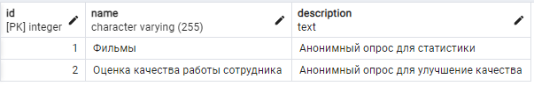

## <sup> Проект релизован в качестве демонстрации api приложения, для  анонимного онлайн опроса. </sup>
### Запуск проекта.
#### Через терминал пройдиет в корневую папку проекта и запустите команду:
```
docker-compose up
```
#### Ссылка приложения:
```
http://localhost:5000/swagger/index.html
```
#### Ссылка pgadmin:
```
http://localhost:5050/browser/

Login: admin@admin.com
Password: root
```

####  Если в конце сборки образа получите ошибку:
```
System.InvalidOperationException: Unable to configure HTTPS endpoint. No server certificate was specified, and the default developer certificate could not be found or is out of date.
```
#### Тогда вам нужно сгенерировать самоподписанный сертификат. Для этого запустите PowerShell от имени администратора или оболочку CMD.
#### Введите следующую инструкцию:
#### Примечание. У вас должен быть установлен NET.CLI
PowerShell
```
dotnet dev-certs https -ep "$env:USERPROFILE\.aspnet\https\aspnetapp.pfx"  -p PASSWORD
dotnet dev-certs https --trust
```
CMD
```
dotnet dev-certs https -ep %USERPROFILE%\.aspnet\https\aspnetapp.pfx -p $CREDENTIAL_PLACEHOLDER$
dotnet dev-certs https --trust
```
#### PASSWORD -  вашь пароль.
#### В файле docker-compose.yml, в окружении сервиса onlinesurvey.api укажите свой пароль
```
 environment:
   - ASPNETCORE_Kestrel__Certificates__Default__Path=/https/aspnetapp.pfx
   - ASPNETCORE_Kestrel__Certificates__Default__Password=ВАШЬ ПАРОЛЬ
```
#### Скрипт по инициализации базыданных в файле init.sql

#### Стек проекта:
+ <sup> Asp Net Core Web Api </sup>
+ <sup> Docker </sup>
+ <sup> Mapster </sup>
+ <sup> PostgresSQL </sup>

## <sup> Архитектура </sup>
### <sup> Монолит потроенный на трёхслойной архитектуре. </sup>
+ <sup> .Infrastructure - Здесь вся работа с данными.</sup>
+ <sup> .Domain - Ядро приложени.</sup>
+ <sup> .Application - Здесь Бизнес логика. </sup>
+ <sup> .Api - Уровень представления </sup>

#### Связи между сущностями в бд:
```
Survey - Question - один к многим (у одного опроса множество вопросов)
Interview -Result - один к многим (у одного интервью множество ответов на вопрос)
Question - Answer - один к одному ( у одного уникального вопроса может быть только один уникальный вариант ответов)
```
#### Структура бд:
 <sup>  </sup>


#### Как работает api:
```
// Возвращает конкретный вопрос (Question) с вариантами ответов, конкретного опроса (Survey)
async Task<IActionResult>GetQuestionAsync(int questionId)

// Принимает Id опроса, Id опроса.Сохранет вопрос и ответы в бд и возвращает Id следующего вопроса
// Далее сохраняет в бд и возвращает Id следующего вопроса
async Task<IActionResult> AddResultAsync(int questionId, List<string> results)
```


